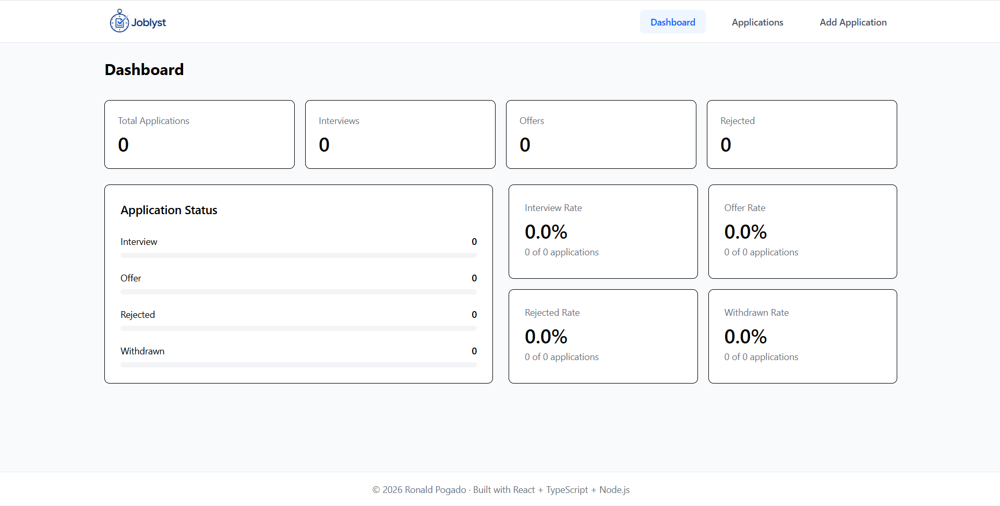
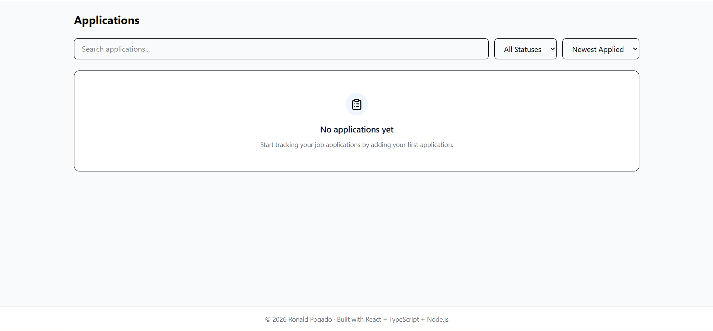
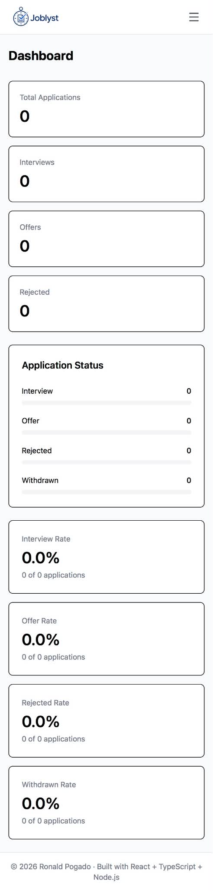
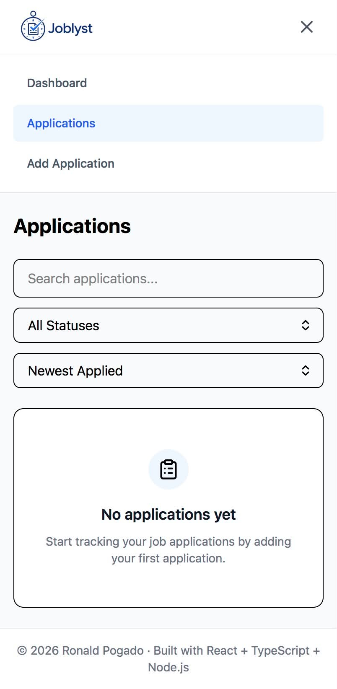
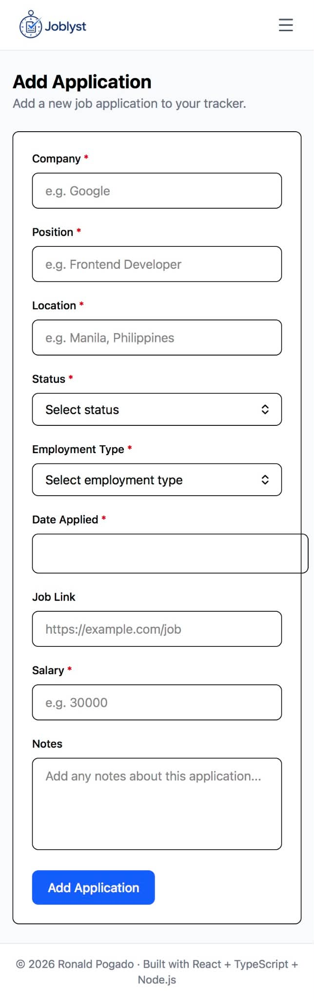

# Joblyst — Job Application Tracker

Joblyst is a responsive job application tracker built to help users organize, monitor, and manage their job applications in one place.

The application provides CRUD functionality, application status tracking, search and filtering, sorting, pagination, dashboard statistics, form validation, and persistent local storage.



## Features

* **Application Management**

  * Add, view, edit, and delete job applications
  * Track company, position, location, employment type, status, and application date
  * Add optional salary, job link, and notes

* **Application Tracking**

  * Track applications using statuses:

    * Applied
    * Interview
    * Offer
    * Rejected
    * Withdrawn

* **Search, Filter & Sort**

  * Search applications by company, position, or location
  * Filter applications by status
  * Sort applications by relevant application information



* **Pagination**

  * Applications are displayed across multiple pages when the list grows

* **Dashboard**

  * View total applications
  * Track interviews, offers, rejected, and withdrawn applications
  * View application and outcome rates

* **Responsive Design**

  * Desktop table layout
  * Mobile-friendly card layout
  * Responsive navigation and forms





* **Form Validation**

  * Required field validation
  * URL validation for job links
  * Salary and optional field handling

* **Toast Notifications**

  * Feedback for actions such as adding, updating, and deleting applications

* **Accessibility**

  * Proper form labels
  * Accessible controls
  * Keyboard-friendly modal interactions
  * Accessible names for icon-only buttons

## Tech Stack

* **React**
* **TypeScript**
* **Vite**
* **Tailwind CSS**
* **React Router**
* **React Hook Form**
* **Zod**
* **Lucide React**
* **Local Storage**

## Getting Started

### Prerequisites

Make sure you have the following installed:

* Node.js
* npm

### Installation

Clone the repository:

```bash
git clone https://github.com/pogadoronald-ctrl/Job-Application-Tracker.git
```

Navigate into the project:

```bash
cd Job-Application-Tracker
```

Install dependencies:

```bash
npm install
```

Start the development server:

```bash
npm run dev
```

The application will be available at the local URL provided by Vite.

## Available Scripts

```bash
npm run dev
```

Starts the development server.

```bash
npm run build
```

Creates a production build of the application.

```bash
npm run lint
```

Runs Oxlint to check the project for code-quality and linting issues.

```bash
npm run preview
```

Previews the production build locally.

## Data Storage

Joblyst currently uses the browser's **Local Storage** to persist application data.

Applications remain available after refreshing the page or restarting the browser on the same device and browser.

No external database is currently required.

## Project Purpose

Joblyst was built as a portfolio project to demonstrate practical frontend development skills, including:

* React component development
* TypeScript
* State management with React Context
* Form handling and validation
* CRUD operations
* Responsive UI development
* Client-side data persistence
* Accessibility considerations
* Application architecture and component organization

## Live Demo

**Joblyst:** https://joblyst-xi.vercel.app/

## Repository

**GitHub:** https://github.com/pogadoronald-ctrl/Job-Application-Tracker

## Author

**Ronald Jhon Pogado**

BS Computer Science Graduate
Xavier University – Ateneo de Cagayan

## License

This project is for portfolio and educational purposes.
